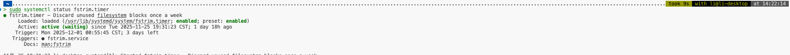
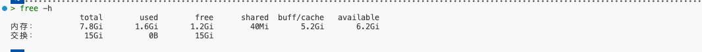

# 主要是因为如果不扩展虚拟内存的话，虽然我的树莓派是8G的RAM，但是编译文件的话还是太慢了，
- 检查 RAM 大小
```bash
free -h
```
- 因为我这里使用的是 硬盘是SSD 格式的
```bash
# 检查是否支持TRIM
sudo fstrim -v /
``` 
输出如下：证明支持 TRIM</br>
<font color="yellow">
sudo fstrim -v /      
/：207.9 GiB (223198400512 字节) 已修剪
</font>
```bash
# 检测fstrim.timer运行状态
sudo systemctl status fstrim.timer
```
输出如下证明

这个服务在运行中
然后使用更先进的软件来管理虚拟内存，但是好像 apt

```bash
# 安装systemd-swap
sudo apt update
sudo apt install systemd-swap
```
发现没有这个软件
那就

```bash
# 关闭 swap
sudo swapoff /swapfile

# 删除旧的 swap 文件
sudo rm /swapfile
# 使用dd指令扩展虚拟内存，一般扩展量是自己原始内存的 2 倍
sudo dd if=/dev/zero of=/swapfile bs=1G count=16 status=progress
# 设置正确的权限
sudo chmod 600 /swapfile

# 格式化为 swap
sudo mkswap /swapfile

# 启用 swap
sudo swapon /swapfile

```
成功扩展之后如下图所示



