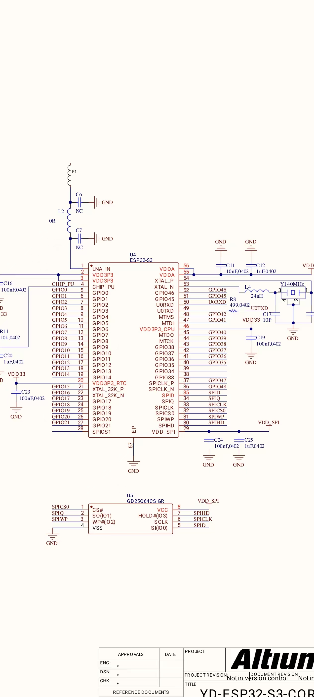

# 本文主要是Arduino的使用
注：Arduino代码是烧录在ESP32主板上的，这个程序的主要作用就是接受ROS2 JAZZY（树莓派5B）发送的信号，再去给下位机PCA9685舵机控制板发送信号</br>
## 1.明确esp32怎么和PCA9685舵机控制板发信号的(IIC协议)
PCA9685是一个常见的16路舵机，它是通过IIC协议来被主机控制的</br>
那我们就需要找到我们板子的原理图

还需要找ESP32-S3-WROOM-1的数据手册
链接<https://documentation.espressif.com/esp32-s3_datasheet_cn.pdf#cd-func-descr>
这里提到了可以是任意引脚都可以，通过GPIO交换矩阵来分配
问题：什么GPIO交换矩阵？
可以通过软件配置，把任意外设信号路由到任意GPIO
就是可以通过我们软件自定义GPIO输出,比如我们可以在.ino文件中这样设置(8,9)是可变的可以随意选择
```cpp
#define IIC_SDA 8
#define IIC_SCL 9
```
方便我们后续的使用
参考链接
源代码如下:
[Arduino.ino](../Arduino/Arduino.ino)

